# Lab 2 - Command Line

## hostname
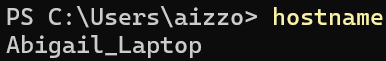

## env
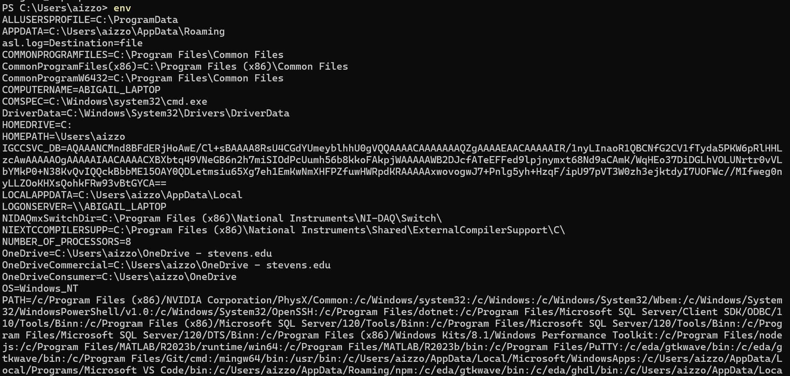
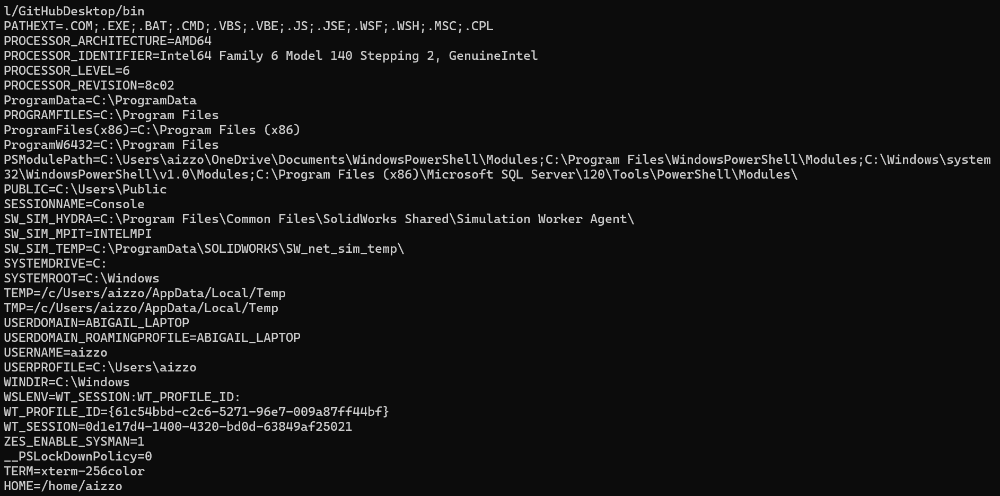

## ps
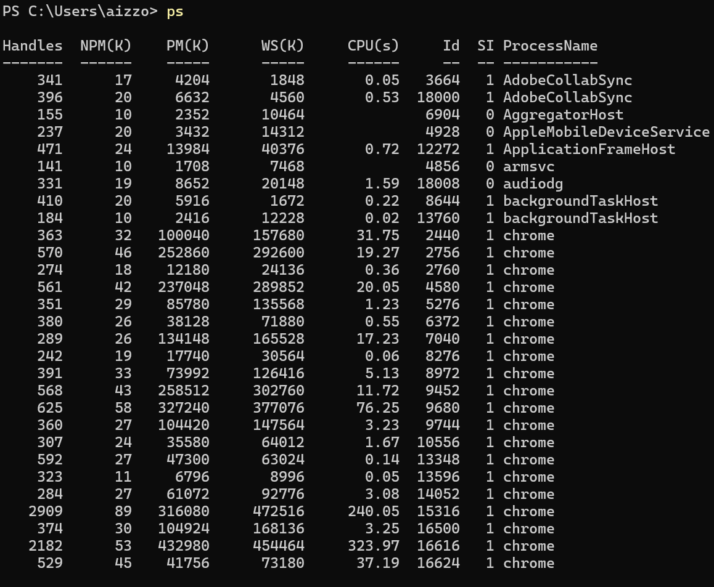
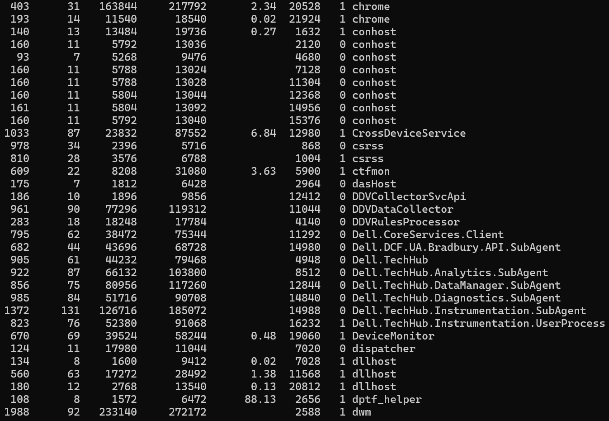

## pwd
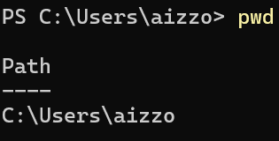

## git clone
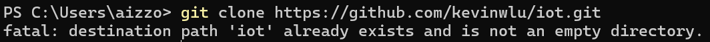

## cd iot, ls
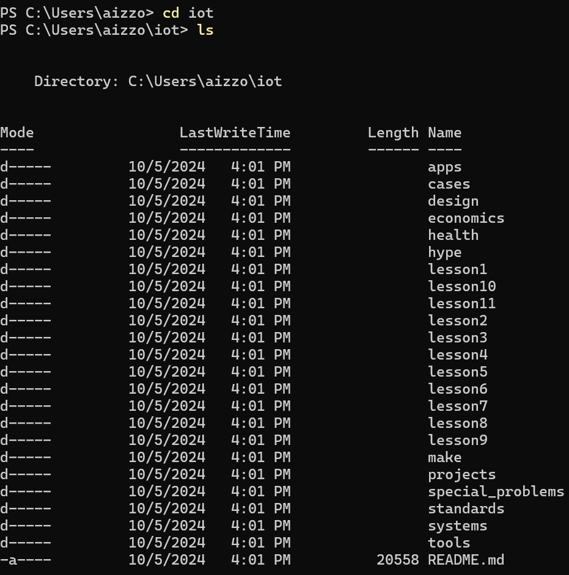

## cd, df, mkdir
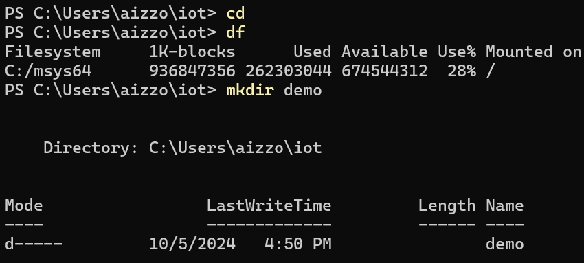

## cd demo

## nano file
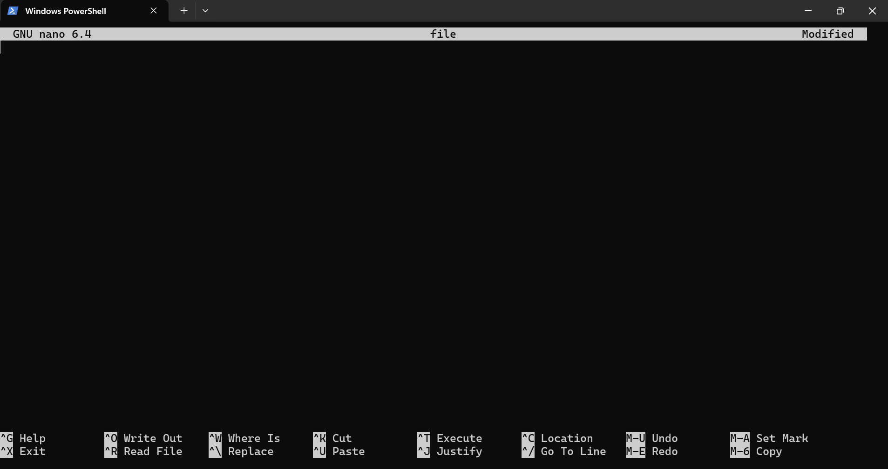

---
# I got a raspberry pi and redid the lab using the raspberry pi:
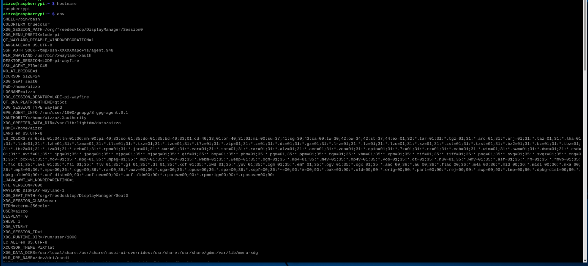
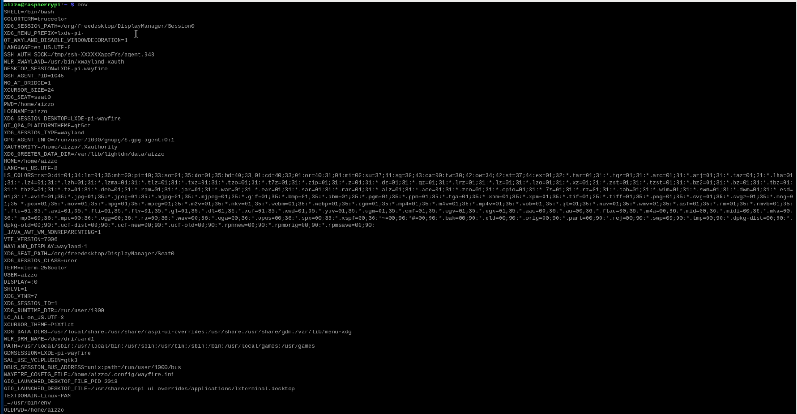
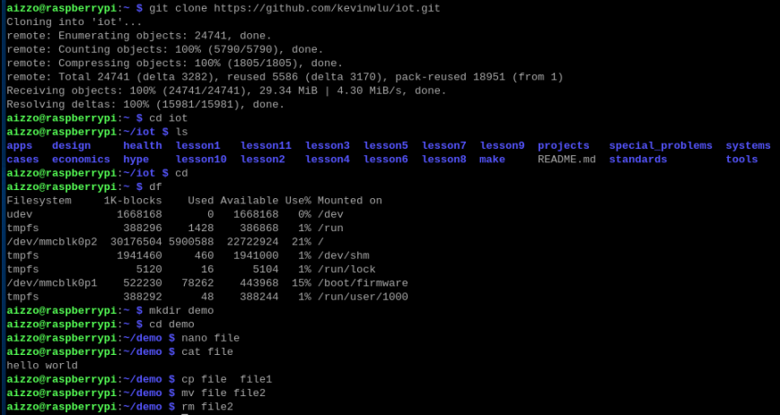
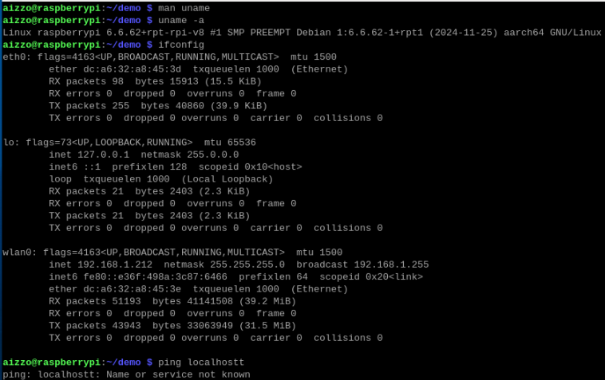
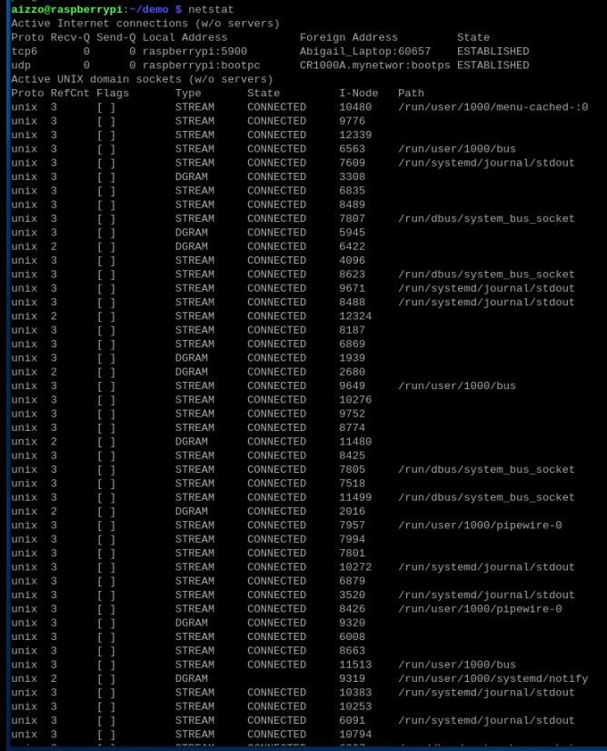
