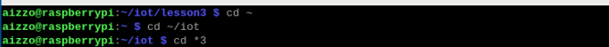
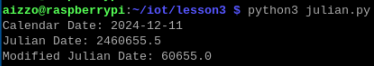
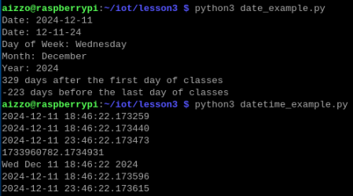
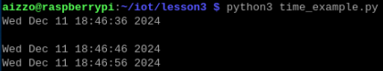
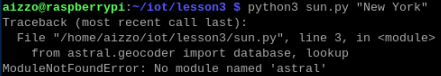
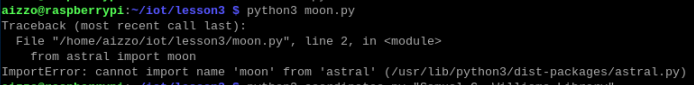
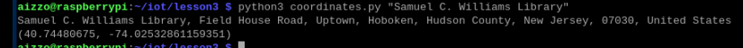
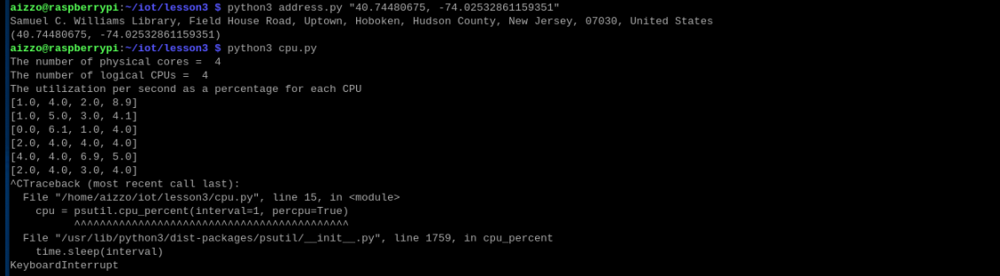
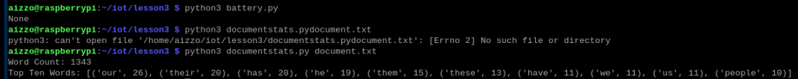

# Lab 3 - Python

## cd

## julian.py

## date_example.py & datetime_example.py

## time_example.py

## sun.py & moon.py

I am unsure why this did not work. I opened the file using the nano command and the file requires astral. I downloaded astral the same way I downloaded jdcal and geopy, using the commands:
- sudo apt install -jdcal
- sudo apt install -astral
- sudo apt install -geopy
The files requiring jdcal and geopy work fine, but not those requiring astral.

## coordinates.py

## address.py & cpu.py

## battery.py & documentstats.py

