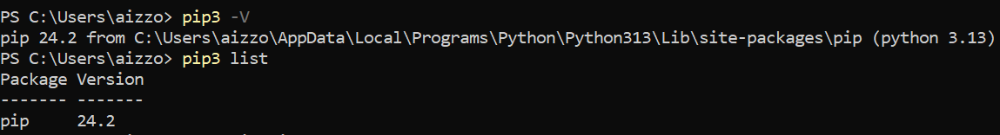
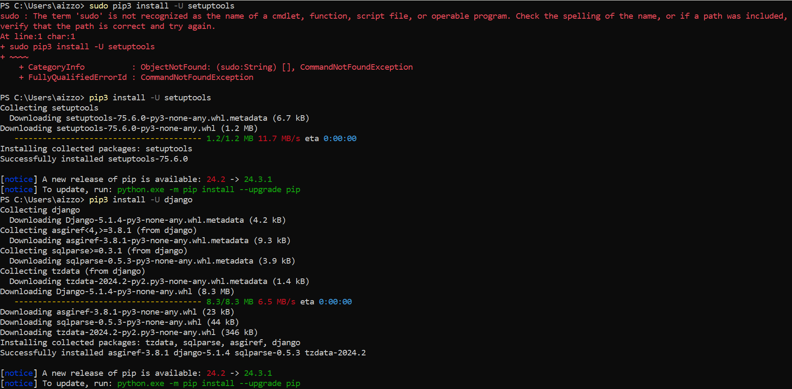
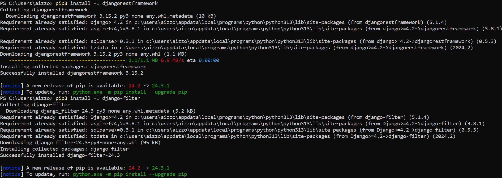
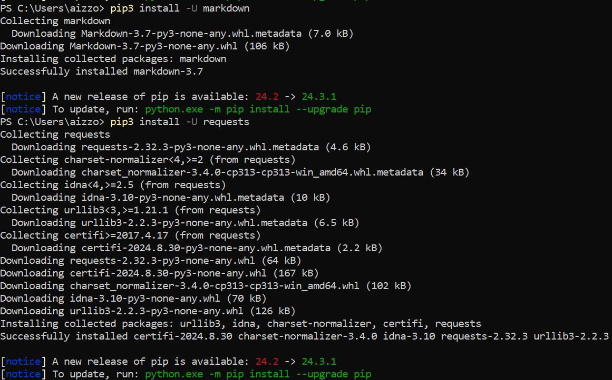
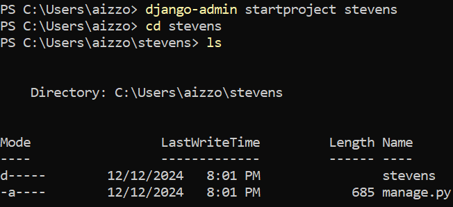
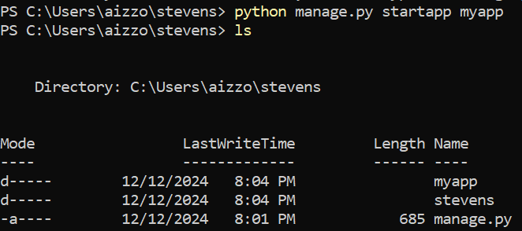
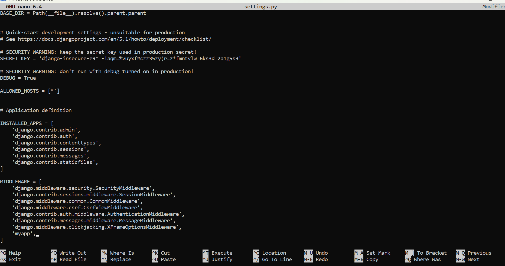

# Lab 4 - Django and Flask
This was completed through the Windows Power Shell.

## List installed packages

## Install Django and Django REST framework
For some reason, sudo does not work on my laptop. Removing the command sudo worked.

## Create Django project called "stevens"

## Updated settings

