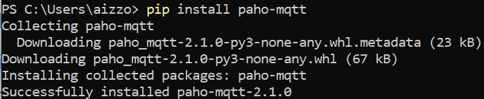
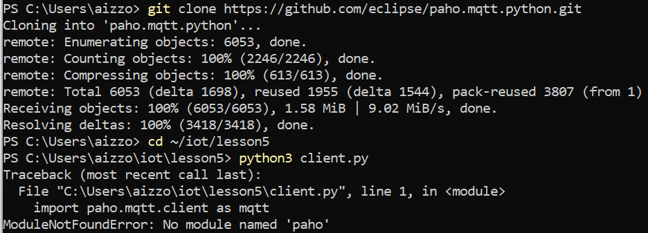
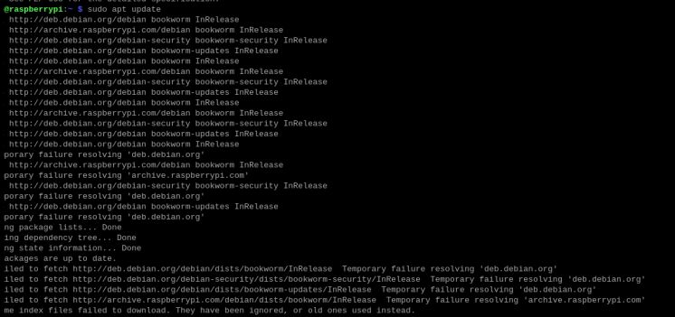
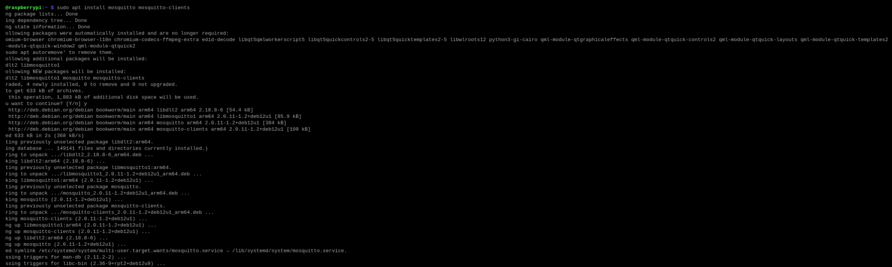
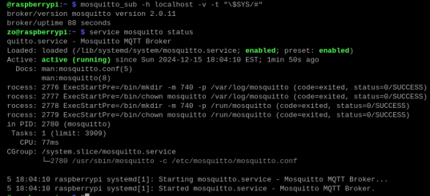
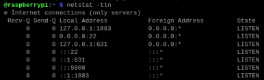
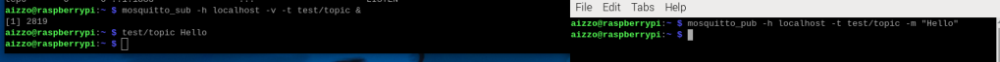
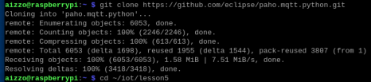
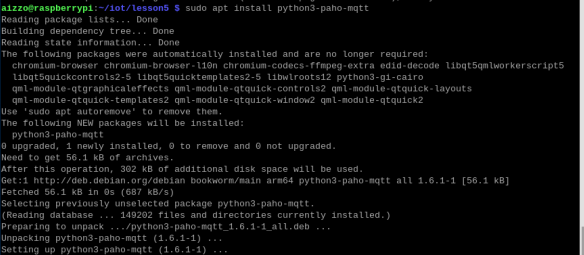
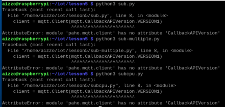

# Lab 5 - Paho-MQTT

## Install Paho
I first tried doing the lab in Windows Power Shell. I installed Paho, but then later it said it could not find Paho. This has been happening a lot in the labs and I am unsure why.

## Install Mosquito
I then switched to the raspberry pi

## Install Paho

## sub.py, sub_multiple.py, subcpu.py
I keep getting this error. Looking on the internet, it seems that 'CallbackAPIVersion' is not an official attribut in Paho. I am unsure how to resolve this.

